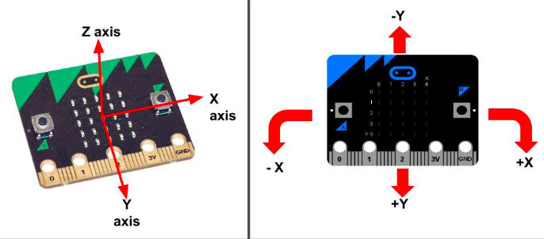

X - tilting from left to right.
Y - tilting forwards and backwards.
Z - moving up and down. 

The measurement for each axis is a positive or negative number. When the reading says 0 this means that you are level along an axis.

